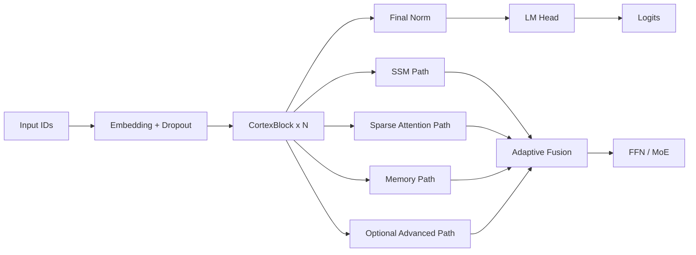
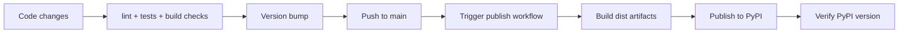

# CortexNet 架构可视化

> 本文给出架构与发布流程的 Mermaid 图，便于在开源介绍页、宣讲和评审中复用。

## 1. 运行时架构图

```mermaid
flowchart LR
    A["Input IDs"] --> B["Embedding + Dropout"]
    B --> C["CortexBlock x N"]
    C --> D["Final Norm"]
    D --> E["LM Head"]
    E --> F["Logits"]

    C --> C1["SSM Path"]
    C --> C2["Sparse Attention Path"]
    C --> C3["Memory Path"]
    C --> C4["Optional Advanced Path"]
    C1 --> C5["Adaptive Fusion"]
    C2 --> C5
    C3 --> C5
    C4 --> C5
    C5 --> C6["FFN / MoE"]
```

## 2. from_pretrained 迁移流程图

```mermaid
flowchart LR
    A["Source model directory"] --> B["Detect model type"]
    B --> C["Convert to CortexNetConfig"]
    C --> D["Instantiate CortexNet"]
    D --> E["Map and load weights"]
    E --> F["Architecture adaptation"]
    F --> G["Optional calibration"]
    G --> H["Device + dtype resolution"]
    H --> I["Ready for inference"]
```

## 3. 开源发布流程图

```mermaid
flowchart LR
    A["Code changes"] --> B["lint + tests + build checks"]
    B --> C["Version bump"]
    C --> D["Push to main"]
    D --> E["Trigger publish workflow"]
    E --> F["Build dist artifacts"]
    F --> G["Publish to PyPI"]
    G --> H["Verify PyPI version"]
```
